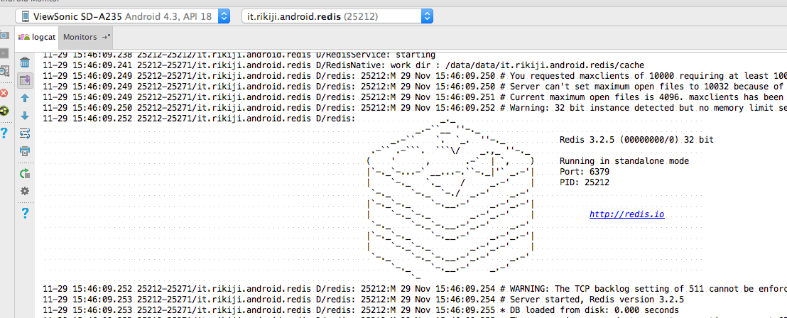

# redis-android

This project is forked from [rikiji/redis-android](https://github.com/rikiji/redis-android).

## Description

This app runs the [Redis Database](http://redis.io/) on Android.
This is still experimental version. (Don't claim please.)

You can run the DB tap on the toggle button.
If you toggles off the button, the database is shutdown (also the app is killed).

## Redis version

The current redis version is 3.2.5.



## How to use this?

Install the apk file from [here](https://github.com/wf9a5m75/redis-android/blob/master/release/app-debug.apk?raw=true), then launch the redis-android app.
After that, connect to your Android from your pc.

```
$> redis-cli -h 192.168.3.15  <--your Android ip

$> set Hello myMessage

$> get Hello
"myMessage"
```

### Quick Q&A

- Clustering?
-- Not yet.

- Protection mode?
-- Disabled at this time.
