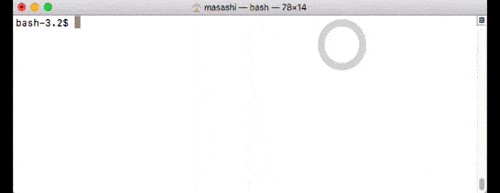

# Redis Android

Redis server embedded as an Android library.



## Versions

- redis-android: 1.2.0
- Redis: 8.8.0
- Hiredis: 1.4.0
- Minimum Android API: 21
- Java: 17

The AAR contains native libraries for:

- `arm64-v8a`
- `armeabi-v7a`
- `x86`
- `x86_64`

## Features

- Runs a Redis server inside an Android application
- Works without an Internet connection
- Supports Redis persistence, TTL, Pub/Sub, Lua scripting, and Redis Functions
- Includes Redis 8 Vector Set commands such as `VADD`, `VSIM`, `VCARD`, and `VDIM`
- Does not require Google Play services

The native Redis process has been adapted for Android so shutdown does not terminate
the hosting application process.

## Installation

The library is published to Maven Central:

```groovy
dependencies {
    implementation 'io.github.wf9a5m75:redis-android:1.2.0'
}
```

For Kotlin DSL:

```kotlin
dependencies {
    implementation("io.github.wf9a5m75:redis-android:1.2.0")
}
```

## Usage

Start Redis from a background service or another dedicated background thread. The
call blocks while the Redis event loop is running.

```java
import android.app.IntentService;
import android.content.Intent;
import android.os.Bundle;

import io.github.wf9a5m75.RedisAndroid;

public class RedisService extends IntentService {
    public RedisService() {
        super("RedisService");
    }

    @Override
    protected void onHandleIntent(Intent intent) {
        Bundle options = new Bundle();
        options.putString("port", "6379");
        options.putString("protected-mode", "yes");
        options.putString("requirepass", "replace-with-a-strong-password");

        RedisAndroid.start(this, options);
    }
}
```

Do not call `RedisAndroid.start(...)` on the Android main thread.

## Configuration

`RedisAndroid` provides Android-oriented defaults and accepts Redis configuration
directives through an Android `Bundle`:

```java
Bundle options = new Bundle();
options.putString("port", "6380");
options.putString("maxmemory", "30mb");
options.putString("appendonly", "yes");
options.putString("requirepass", "replace-with-a-strong-password");

RedisAndroid.start(context, options);
```

Multiple-value directives can be supplied as an `ArrayList<String>`:

```java
ArrayList<String> save = new ArrayList<>();
save.add("900 1");
save.add("300 10");
options.putStringArrayList("save", save);
```

See the [Redis configuration documentation](https://redis.io/docs/latest/operate/oss_and_stack/management/config/)
and the current
[`RedisAndroid.java`](redis-android/src/main/java/io/github/wf9a5m75/RedisAndroid.java)
defaults.

## Security

The embedded server opens a TCP socket. Keep `protected-mode` enabled, configure
authentication, and restrict network exposure unless remote access is explicitly
required.

The sample application disables protected mode and authentication for demonstration
only. Do not use those settings in production.

## Connecting

Use any Redis-compatible Java or Android client and connect to the configured host
and port. See the [Redis client list](https://redis.io/docs/latest/develop/clients/).

This project builds only the embedded `libredis.so`. It does not currently publish
Android binaries for `redis-cli`, `redis-check-aof`, or `redis-check-rdb`.

## Building

Install Android SDK Platform 37 and Android NDK `30.0.14904198`, then run:

```bash
./gradlew buildNative
./gradlew assembleDebug
```

The Android Gradle Plugin runs `ndk-build` through `externalNativeBuild`. Native
outputs are stored in Gradle build directories and packaged into the AAR
automatically. Publishing tasks also build the native libraries before publishing.

## Publishing

The root project provides these tasks:

```bash
./gradlew publishAllLocal
./gradlew publishAllToGitHub
./gradlew submitAllToMavenCentral
```

Maven Central submissions use Central Portal's user-managed mode. The workflow
uploads and validates a deployment but does not publish it automatically.

## Compatibility

| Redis version | redis-android version |
|---|---|
| Redis 8.8.0 | 1.2.0 |
| Redis 5.0.5 | 1.1.6 |
| Redis 5.0.4 | 1.1.5 |
| Redis 5.0.3 | 1.1.4 |
| Redis 5.0.2 | 1.1.3 |
| Redis 5.0.1 | 1.1.1 - 1.1.2 |
| Redis 5.0.0 | 1.1.0 |
| Redis 4.0.11 | 1.0.8 |
| Redis 4.0.10 | 1.0.7 |
| Redis 4.0.9 | 1.0.6 |
| Redis 4.0.8 | 1.0.4 - 1.0.5 |
| Redis 4.0.6 | 1.0.0 - 1.0.3 |

## License

See [LICENSE.txt](LICENSE.txt). Redis and bundled third-party components retain
their respective licenses.
